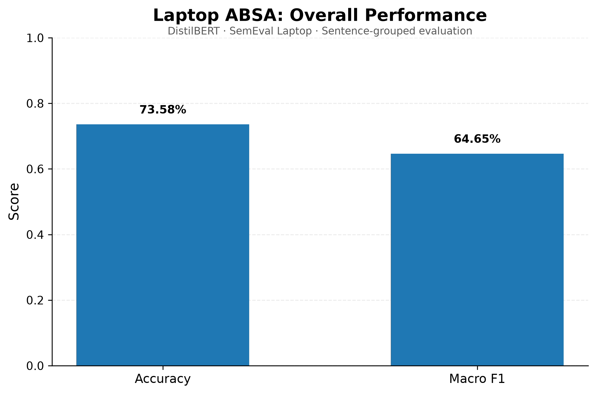
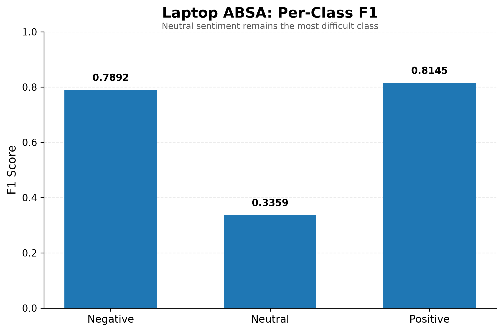
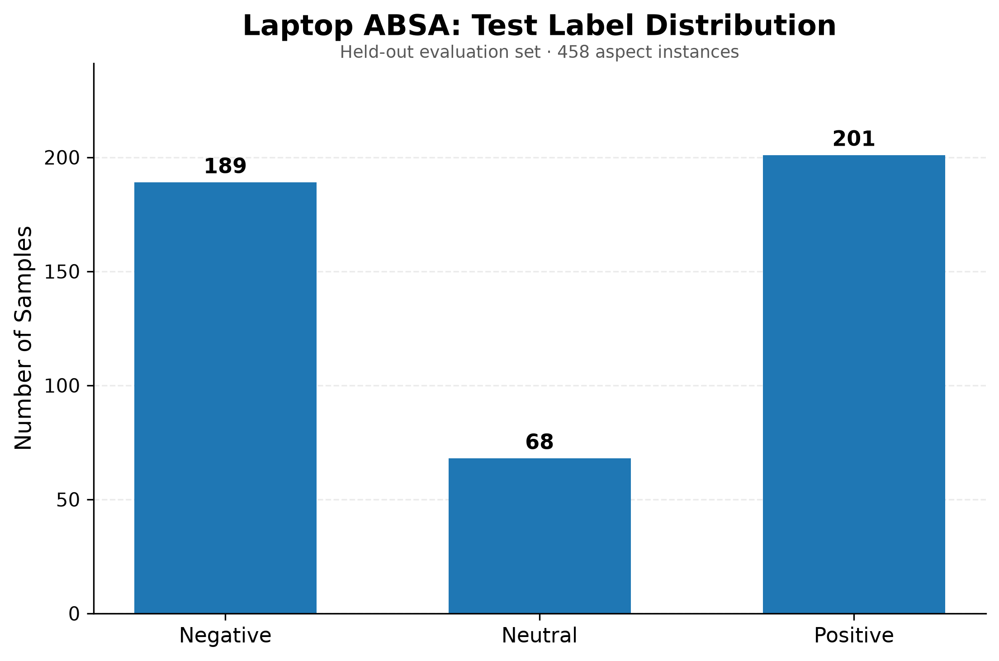
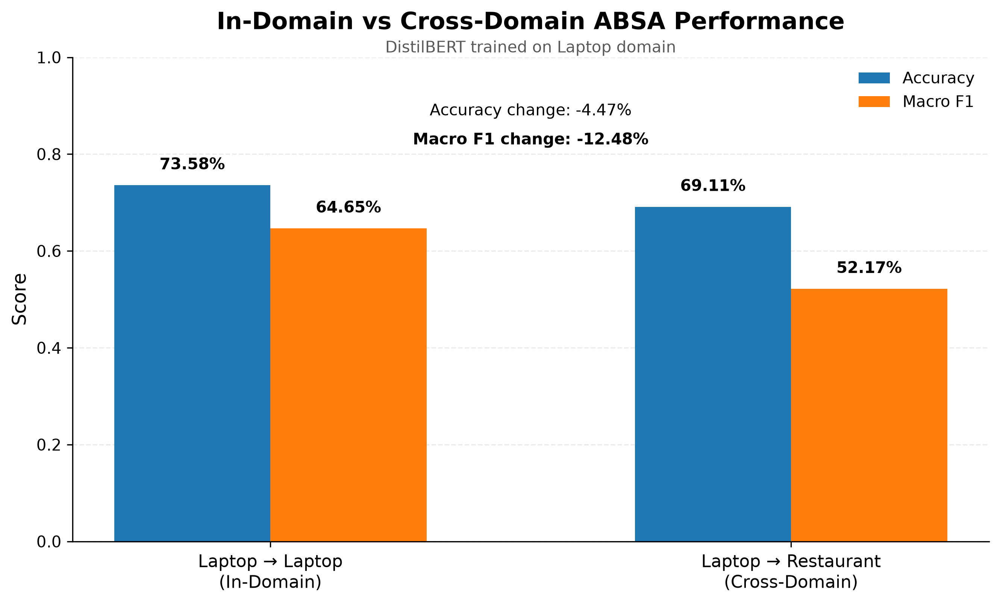

# Cross-Domain Aspect-Based Sentiment Analysis

A research-oriented NLP project exploring **Aspect-Based Sentiment Analysis (ABSA)**, with a focus on **cross-domain adaptation under limited labeled target-domain data**.

## Overview

Aspect-Based Sentiment Analysis aims to identify sentiment toward a specific aspect within a sentence.

For example:

> The battery life is great but the screen is terrible.

The sentiment depends on the target aspect:

- **battery life** → Positive
- **screen** → Negative

Unlike sentence-level sentiment classification, ABSA requires the model to consider both the sentence and the target aspect.

## Research Goal

The long-term goal of this project is to investigate how well an ABSA model trained in one domain can generalize to another domain.

The planned experimental setting is:

```text
Laptop → Laptop
      In-Domain Baseline

Laptop → Restaurant
      Cross-Domain Evaluation

Restaurant → Laptop
      Cross-Domain Evaluation

Limited Target-Domain Data
      ↓
1% / 5% / 10% labeled samples
      ↓
Few-shot Domain Adaptation
```

The current stage establishes the **Laptop in-domain baseline**.

---

## Current Model

The current Transformer baseline uses:

- **Dataset:** SemEval Laptop ABSA
- **Model:** DistilBERT
- **Task:** 3-class aspect sentiment classification
- **Classes:** Negative / Neutral / Positive
- **Input:** Sentence + target aspect
- **Training epochs:** 3
- **Split:** 80% training / 20% held-out evaluation
- **Split strategy:** Grouped by sentence to prevent sentence-level leakage

Example model input:

```text
Sentence: The battery life is great but the screen is terrible.
Aspect: battery life
```

Output:

```text
Positive
```

---

## Experimental Results

### Overall Performance

The current Laptop in-domain experiment achieves:

| Metric | Score |
|---|---:|
| Accuracy | **73.58%** |
| Macro F1 | **0.6465** |
| Test Loss | 0.6512 |
| Test Samples | 458 |



### Per-Class Performance

| Sentiment | F1 Score |
|---|---:|
| Negative | **0.7892** |
| Neutral | **0.3359** |
| Positive | **0.8145** |



The model performs relatively well on positive and negative sentiment, while **neutral sentiment remains substantially more difficult**.

One possible contributing factor is class imbalance in the evaluation data.

### Test Label Distribution



The held-out test set contains:

- Negative: 189
- Neutral: 68
- Positive: 201

---

## Experimental Design

To reduce data leakage, the dataset is not randomly split at the individual aspect-instance level.

Instead, samples are grouped by their original sentence before splitting.

```text
SemEval Laptop ABSA
        ↓
Remove conflict labels
        ↓
Group by sentence
        ↓
80% Train / 20% Test
        ↓
Sentence overlap = 0
        ↓
Fine-tune DistilBERT
        ↓
Held-out Evaluation
```

This ensures that different aspects from the same sentence do not appear in both the training and evaluation sets.

---

## Project Progress

- [x] Rule-based ABSA baseline
- [x] Sentence-level Transformer baseline
- [x] SemEval Laptop dataset preprocessing
- [x] Aspect-conditioned DistilBERT fine-tuning
- [x] Sentence-grouped in-domain evaluation
- [x] Result visualization
- [ ] Laptop → Restaurant cross-domain evaluation
- [ ] Restaurant → Laptop cross-domain evaluation
- [ ] Few-shot target-domain adaptation
- [ ] 1% / 5% / 10% target-domain experiments
- [ ] Cross-domain performance comparison

---

## Project Structure

```text
cross-domain-absa/
├── data/
│   ├── laptop/
│   ├── restaurant/
│   └── sample_absa.csv
│
├── figures/
│   ├── overall_metrics.png
│   ├── class_f1_scores.png
│   └── label_distribution.png
│
├── results/
│   ├── rule_based_results.txt
│   ├── transformer_results.txt
│   └── laptop_absa_results.txt
│
├── src/
│   ├── baseline.py
│   ├── transformer_baseline.py
│   ├── inspect_dataset.py
│   ├── aspect_transformer.py
│   └── plot_results.py
│
├── notebooks/
├── .gitignore
├── LICENSE
└── README.md
```

Raw SemEval dataset files and trained model checkpoints are excluded from the repository.

---

## Cross-Domain Evaluation

To evaluate cross-domain generalization, the model trained on the
**Laptop** domain was directly evaluated on a held-out
**Restaurant** domain test set without additional Restaurant-domain
training.

### Results

| Evaluation | Accuracy | Macro F1 |
|---|---:|---:|
| Laptop → Laptop (In-Domain) | 73.58% | 0.6465 |
| Laptop → Restaurant (Cross-Domain) | 69.11% | 0.5217 |

Compared with the in-domain evaluation:

- Accuracy decreased by **4.47 percentage points**
- Macro F1 decreased by **0.1248**

The larger decrease in Macro F1 indicates that performance degradation
is not distributed equally across sentiment classes. In particular,
neutral sentiment becomes substantially more difficult under
cross-domain transfer.



---

## Next Step

The next stage will investigate **low-resource target-domain adaptation**.

The goal is to determine whether a small amount of labeled Restaurant
data can improve the performance of the Laptop-trained model.

Planned experiments:

- 0% target-domain data (current cross-domain baseline)
- 1% labeled Restaurant data
- 5% labeled Restaurant data
- 10% labeled Restaurant data

All adapted models will be evaluated on the same held-out Restaurant
evaluation set to ensure a consistent comparison.

The main research question is:

> How much labeled target-domain data is required to recover performance
> lost under domain shift?